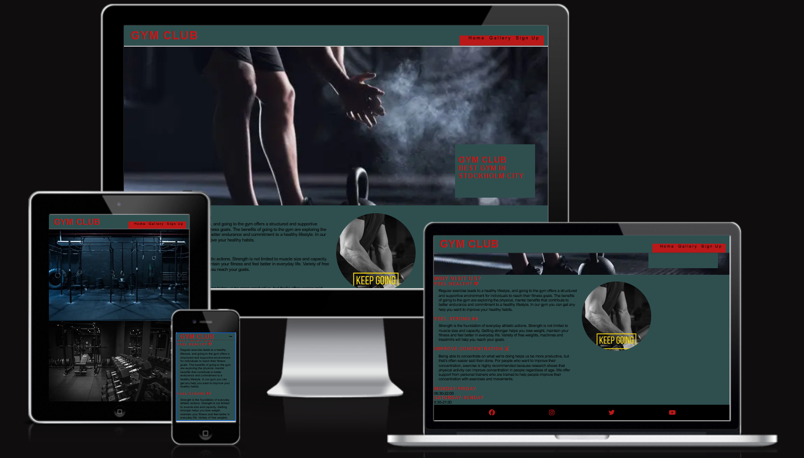
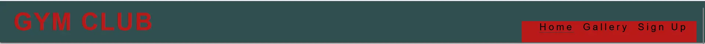
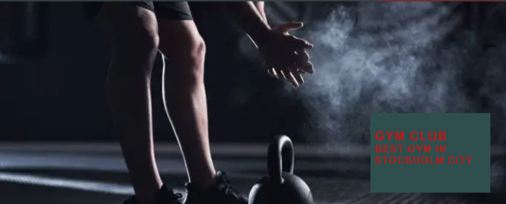
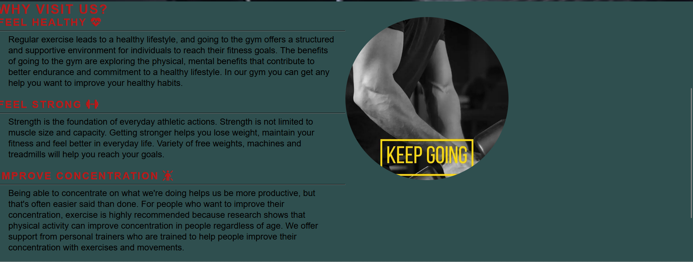
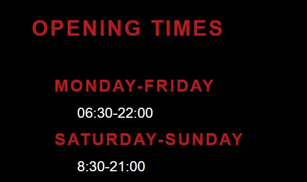
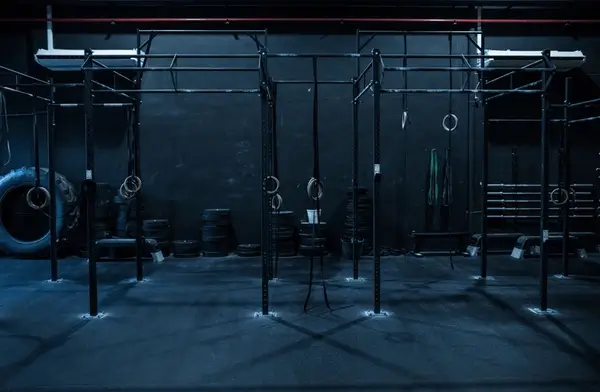
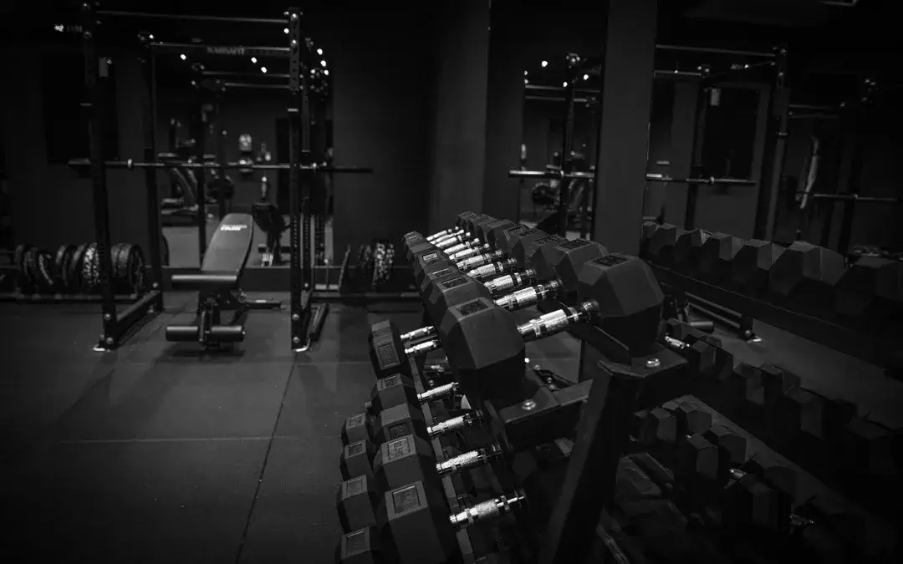

# Gym Club
Gym Club is a modern gym in the center of Stockholm. The gym is equipped with the latest equipment for maintaining fitness as well as strength training. On our website you can find information on why it is good to maintain your fitness and a healthy lifestyle. This gym can provide you with additional services such as sessions with personal trainers who have years of experience behind them. The goal of this site is to motivate people to lead a better and more active lifestyle.

## Site Owner Goals 
- To provide the user with information about the benefits of exercise and physical activity, with a particular focus on body movements.
- To present the user with a website that is easy to navigate, fully responsive and evokes a feeling of through the use of appropriate colors and images.
- To make the club's members feel good and want to come to a pleasant and active environment where you can feel motivated.

## Design

### Imagery
The imagery used on the Gym Club site  crucial for users of the site. A dark theme is used on this site, as well as pictures of the gym. This adds a little bit of mistery which can motivate people to to even better in the gym. The site shows pictures of the gym and studies shows that working out in the dark allows us to conect our body even more and it motivate us to be more effective. 

### Colours
The colour scheme of the website is dark green colours followed with red letters to make a text and social networks pop up even more. 

### Fonts
The Redit+Mono font is the main font used on this website. This font was imported via [Google Fonts](https://fonts.google.com/). I'm using Sans Serif as a backup font just in case Redit+Mono is not imported well.

## Wireframes

## Features
- ### Navigation

    - The fully responsive navigation bar includes links to the Logo, Home, Gallery, Sign Up.
    - The navigation section allows users to easly navigate throught a website without need to scroll up and down.

- ### The Landing Page Image
    - The landing page includes an first impresion image with the eye-catching information.
    - This section provides the user representation of the purpose of the site.

- ### Why Section
    - The Why Section gives a brief description of why moving our body is good for overal health. 
    - Behind Why Section is small cirkular picture of motivational words.
    - This section will show users what they can expect on this website, as well as additional sevices in the gym.

- ### Opening Section
    - This section contains opening times at weekdays and opening times on weekend.
    

- ### Footer Section
    - In this section users can find links to social media of the website.
    - Social networks that shows in this section are Facebook, Instagram, Twitter and YouTube.

- ### Gallery Section
    - In this section users can find pictures of our gym.

.jpg)

- ### Sign Up Section

## Testing

### Validator Testing
- #### HTML
    - No errors were returned when passing through the W3.org validator.
    - [W3C Validator Results](https://validator.w3.org/nu/?showsource=yes&doc=https%3A%2F%2FErmaa8.github.io%2FGym-club%2Findex.html)

- #### CSS
    - No errors were returned when passing through the W3.org validator.
    - [W3C Validator Results]

- #### Accessibility 

### Testing
- Form testing has been has been tested to make sure it will not submit withous properly added data(name,surname and e-mail adress). 
-All links were tested manually to meke sure the user is directed to correct part of the website.
-Social media links were tested manually as well to be sure user will be directed to correct social media.
-Website was tested on diferent browsers with no issues.

### Fixed Bugs
- Problem that has arisen during the course of the project is the deployment section. The structure of the site was not good at all but it was quickly solved by removing the '/' sign from the code.

## Technologies

### Languages
- HTML5
- CSS

### Frameworks - Sites - Programs 
- [Am I Responsive](https://ui.dev/amiresponsive)- Uset to make site visible on different devices.
- [GitHub](https://github.com/)- Github is used to test every change.
- [GoogleFonts](https://fonts.google.com/)- Used to add additional style to text.
- [TinyPNG](https://tinypng.com/)- Used to adjust a pictures.
- [W3C](https://tinypng.com/)- Used to tst HTML and CSS code.
- [Balsamic](https://balsamiq.cloud/stzqsdg/p47bneq/r2A03)- Used to make wireframes.
- [FontAwesome](https://fontawesome.com/)- Used to add icons to footer.

## Deployment

The project was deployed using GitHub pages. The steps for this part are listed bellow:

1. Open a GitHub.com
2. Select 'Settings' on right corener.
3. Select 'Pages' from the menu bar on the left of the page.
4. Open dropdown menu and select the main branch.
5. Once selected, click the 'Save'.
6. Deployment should be confirmed and clickable.

The live link can be found here : [Gym Club](https://ermaa8.github.io/Gym-club/)

## Credits

### Content
- All content and pictures are used from the following sites.
- [Text](https://www.wellandgood.com/working-out-in-the-dark/)
- [Feel strong P](https://www.mensjournal.com/health-fitness/10-strength-building-strategies)
- [Feel healthy P](https://medium.com/@muriithi2222/the-benefits-of-going-to-the-gym-a-pathway-to-a-healthy-lifestyle-444de13892a8)
- [Hero image](https://pngtree.com/freebackground/fitness-equipment-and-black-dumbbells-in-3d-rendering-of-a-dark-workout-room_4839926.html)
- [Picture one](https://www.bakerlabels.co.uk/bakers-gym/)
- [Picture two](https://www.google.com/search?q=dark+gym&client=firefox-b-d&sca_esv=a793da27159ce01a&udm=2&biw=1280&bih=587&ei=iCgJZoy4EPyrkdUPh4qc0AY&ved=0ahUKEwiMnOX1k56FAxX8VaQEHQcFB2oQ4dUDCBA&uact=5&oq=dark+gym&gs_lp=Egxnd3Mtd2l6LXNlcnAiCGRhcmsgZ3ltMgcQABiABBgTMgcQABiABBgTMgcQABiABBgTMgcQABiABBgTMgcQABiABBgTMgcQABiABBgTMgcQABiABBgTMgcQABiABBgTMgcQABiABBgTMgcQABiABBgTSNYbUNEDWO0YcAJ4AJABAJgBcqABvgaqAQMyLja4AQPIAQD4AQGYAgmgAtEHqAIAwgIGEAAYCBgewgIFEAAYgATCAgoQABiABBiKBRhDwgIEEAAYHpgDBIgGAZIHAzEuOKAHziQ&sclient=gws-wiz-serp#vhid=hG0bdwks8TxmCM&vssid=mosaic)
- [Picture three](https://www.google.com/search?q=gym+changing+room+dark&client=firefox-b-d&sca_esv=a793da27159ce01a&udm=2&biw=1280&bih=587&sxsrf=ACQVn0-Fy1q3oGRC6Nkrq0STYt8-iSBYhQ%3A1712070213837&ei=RR4MZovhMrahkdUP0fWD4AQ&ved=0ahUKEwjLl7TH5qOFAxW2UKQEHdH6AEwQ4dUDCBA&uact=5&oq=gym+changing+room+dark&gs_lp=Egxnd3Mtd2l6LXNlcnAiFmd5bSBjaGFuZ2luZyByb29tIGRhcmtIxAxQmwRY2AhwAXgAkAEAmAFooAHrA6oBAzMuMrgBA8gBAPgBAZgCA6AC4wHCAgcQABiABBgTwgIIEAAYBxgeGBPCAggQABgFGB4YE5gDAIgGAZIHAzEuMqAH9Qk&sclient=gws-wiz-serp#vhid=UNMfOx1ml0fEyM&vssid=mosaic)

## Acknowledgments
My mentor Antonio for support and help.

The Code Institute slack community for all previous examples and solutions!

    

    
  

    

 

    

  
    
 
    

